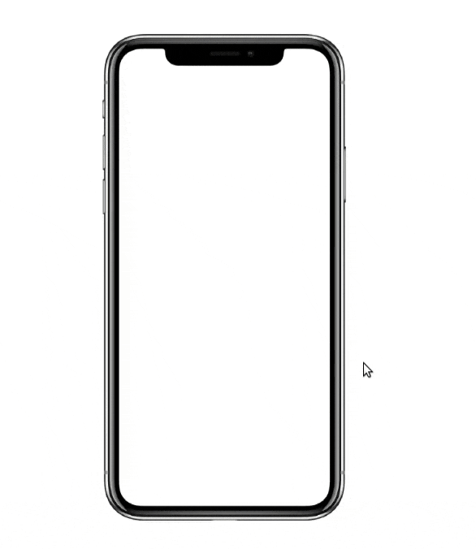

# iPhone Internals

This project is a clone of Max Chafkin and Ian King's widly popular popular piece "[Apple iPhone Guts](https://www.bloomberg.com/features/apple-iphone-guts/)". I use CSS 3D transformations to enrich the original - namely by creating a card flip animation.

This is what the 3D transformation looks like:



## Methodology

The trick is to have two overlapping div elements - one for the front and another for the back. Each div contains a child img element. Keep the back div at `rotate(180)` and the front div at `rotate(0)`. Then on hover, the front div will transition to `rotate(-180)` and the back div will transition to `rotate(0)`  

```css
.front {
    transform: rotateY(0deg);
}

.back {
    transform: rotateY(180deg);
}

.front:hover {
    transform: rotateY(-180deg);
}

.back:hover {
transform: rotateY(0deg);
}

```

## Locally Hosting

Using npm:

```
npm install
```

Start the app:

```
npm start
```

## Public URL

The project is also deployed on Netlify. Check out this [link](https://iphone-flip.netlify.app/). 

## Credits

Obviously all the credits go out to the Bloomberg Graphics team. Great job as always!